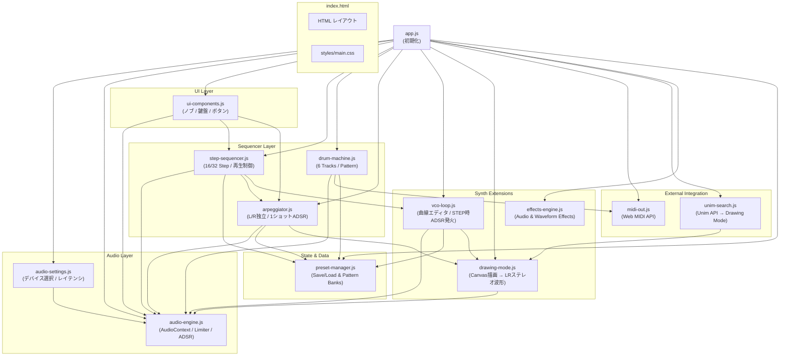
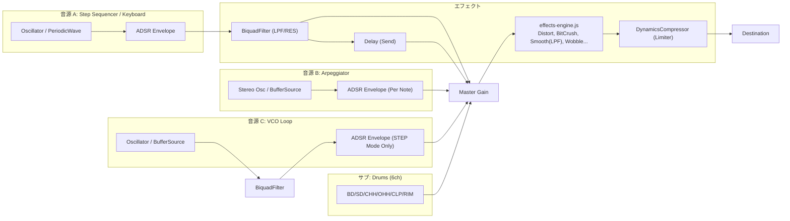

# DLOSy20 - ソフトウェア技術ドキュメント

## 技術スタック

| レイヤー     | 技術              | 備考                                                    |
| ------------ | ----------------- | ------------------------------------------------------- |
| マークアップ | HTML5             | セマンティック構造、単一ページ                          |
| スタイリング | Vanilla CSS       | CSS変数でデザインシステム管理                           |
| ロジック     | JavaScript (ES6+) | クラスベース、フレームワーク不使用                      |
| 音声処理     | Web Audio API     | OscillatorNode / BufferSource / BiquadFilter / GainNode |
| 外部連携     | Web MIDI API      | MIDI OUT (外部機器/DAW制御)                             |
| フォント     | Google Fonts      | Orbitron (Display) / Share Tech Mono (Mono)             |
| 開発サーバー | npx serve         | Node.jsベースの静的サーバー                             |

> [!NOTE]
> フレームワーク（React/Vue等）やバンドラー（Vite/Webpack等）は使用していません。
> すべてのJSファイルは `<script>` タグで直接読み込まれます。

---

## ソフトウェア構成図

### ファイル構造

```
DLOSy20/
├── index.html                 ← エントリーポイント（レイアウト定義）
├── styles/
│   └── main.css               ← 全スタイル定義（CSS変数 + コンポーネント）
├── js/
│   ├── audio-engine.js        ← Web Audio API 音声エンジン
│   ├── audio-settings.js      ← オーディオ出力設定 (デバイス/レイテンシ/Limiter)
│   ├── ui-components.js       ← ノブ・鍵盤・ボタン UI
│   ├── app.js                 ← メイン初期化スクリプト
│   ├── step-sequencer.js      ← 16/32ステップシーケンサー（シームレス切替）
│   ├── drum-machine.js        ← ドラムマシン (6 tracks: BD/SD/CHH/OHH/CLP/RIM)
│   ├── arpeggiator.js         ← アルペジエータ (L/R独立、ADSR、Draw波形対応)
│   ├── adsr-editor.js         ← ADSR曲線ビジュアルエディタ (未接続)
│   ├── midi-out.js            ← MIDI OUT (Web MIDI API / Korg Volca Drum連携)
│   ├── vco-loop.js            ← VCO Loop 曲線エディタ (STEP/CONT, ADSR対応)
│   ├── drawing-mode.js        ← Drawing Mode 描画→波形変換（8/16スロット）
│   ├── unim-search.js         ← Unim Unicode検索 → Drawing Mode連携
│   ├── effects-engine.js      ← 音声/波形エフェクトエンジン (Web Audio API)
│   ├── preset-manager.js      ← 状態・パターンの保存/復元 (localStorage/JSON)
└── Doc/
    └── architecture.md        ← 本ドキュメント
```

### モジュール依存関係



### 音声ルーティング



---

## MIDI 仕様 (MIDI OUT)

Korg Volca Drum 対応のチャンネル分離方式で、各ドラムパートが個別の MIDI チャンネルで送信されます。

| DLOSy20 パート | MIDI Ch | Volca Drum Part |
| -------------- | ------- | --------------- |
| **BD**         | Ch 1    | Part 1          |
| **SD**         | Ch 2    | Part 2          |
| **CHH**        | Ch 3    | Part 3          |
| **OHH**        | Ch 4    | Part 4          |
| **CLP**        | Ch 5    | Part 5          |
| **RIM**        | Ch 6    | Part 6          |

- **ノート番号**: 60（固定。Volca Drum はノート番号を無視）
- **ベロシティ**: 100
- **Note Off**: 50ms 後に自動送信
- **接続**: ブラウザ経由での MIDI デバイス列挙・選択が可能

> [!NOTE]
> Web MIDI API は HTTPS または localhost でのみ動作します（Chrome推奨）。

---

## 開発サーバー起動手順

### 前提条件

- **Node.js** (v16以上) がインストール済みであること

### コマンド

```powershell
npx -y serve@latest ./
```

起動後、 `http://localhost:3000` にアクセス。

> [!TIP]
> `npx -y` により `serve` パッケージを自動インストール＆実行します。
> ポートが使用中の場合は `3001` 等の別ポートが自動割り当てされます。

### 停止

ターミナルで `Ctrl + C` を押してサーバーを停止します。

### 代替手段（Python）

```powershell
cd c:\Freefile\PROJECT\2026\02_DLOSyV2603\2_prj\DLOSy20
python -m http.server 3000
```

---

## VCO Loop パラメータスケーリング

`frequency` と `cutoff` は **対数スケール** を使用。低音域で細かく、高音域でおおざっぱに調整可能。

| パラメータ | スケール | 変換式                  |
| ---------- | -------- | ----------------------- |
| frequency  | 対数     | `min * (max/min)^y`     |
| cutoff     | 対数     | `min * (max/min)^y`     |
| 他全て     | 線形     | `min + y * (max - min)` |

### 発音モード

| モード | 動作                                           | ADSRカーブ                     |
| ------ | ---------------------------------------------- | ------------------------------ |
| STEP   | ステップ同期で離散的にパラメータ更新           | **有効** (各ステップで発火)    |
| CONT   | `requestAnimationFrame` でステップ間を連続補間 | **無効** (VOLカーブが直接制御) |

---

## UIレイアウト

### 画面構成 (100vh Flex / Grid)

画面全体（`100vh`）にフィットし、各パネル内で個別にスクロール(`overflow-y: auto`)するレイアウト設計。

- **LEFT (260px)**: SYNTH パネル（波形選択、キーボード、オクターブ等）
- **CENTER (1fr)**: タブ切り替え（横スクロール禁止 `overflow-x: hidden`）
  - **SEQUENCER タブ**: Step Sequencer (16/32step切替)
  - **DRUMS タブ**: 6トラック Drum Machine
  - **ARP タブ**: アルペジエータ (L/R独立, Freq/Ratio/Glitch, Draw波形対応)
  - **Unim Glyph Search**: 中央上部に常時表示
- **RIGHT (280px)**: EFFECTS パネル
  - 10種類のエフェクト（ON/OFFトグル＋パラメータスライダー）をスクロールで管理
  - ヘッダー部に **AUDIO SETTINGS**（出力デバイス/レイテンシ/リミッター）ボタン
- **BOTTOM**: VCO Loop（STEP/CONT切替, ADSR対応）+ Drawing Mode（8/16スロット切替）

### プリセット・パターン管理

- **全体保存 (Preset Manager)**
  - ヘッダーに 💾 SAVE / 📂 LOAD ボタン（JSONエクスポート/インポート）
  - `localStorage` による自動保存（2秒遅延のデバウンス処理）
- **パターンバンク (Pattern Bank)**
  - `SEQUENCER`, `DRUMS`, `VCO LOOP` の各モジュールに **8つのパターンスロット** (`[1]`〜`[8]`) を保有
  - バンク切り替え時に現在のパターンを自動保存し、対象スロットのパターンを即座に復元。演奏中でもシームレスに切り替え可能。

---

## 主要モジュール概要

| モジュール          | 責務                                       | グローバル変数名 |
| ------------------- | ------------------------------------------ | ---------------- |
| `audio-engine.js`   | AudioContext管理、シンセ/ドラム音源作成    | `audioEngine`    |
| `audio-settings.js` | デバイス選択、レイテンシ設定、リミッター   | `audioSettings`  |
| `effects-engine.js` | 10種のエフェクト処理とAudioNode管理        | `effectsEngine`  |
| `step-sequencer.js` | 16/32ステップの記録・同期再生              | `stepSequencer`  |
| `drum-machine.js`   | 6トラックのドラムパターン・一括制御        | `drumMachine`    |
| `arpeggiator.js`    | L/R独立アルペジエータ (Draw波形・ADSR対応) | `arpeggiator`    |
| `midi-out.js`       | Web MIDI API を介した外部出力管理          | `midiOut`        |
| `vco-loop.js`       | 8パラメータ曲線エディタ、STEP時ADSR発火    | `vcoLoop`        |
| `drawing-mode.js`   | 波形描画キャンバス（8/16スロット切替）     | `drawingMode`    |
| `unim-search.js`    | Unim Unicode検索・グリフ適用               | `unimSearch`     |
| `preset-manager.js` | プリセット保存/読込・パターンバンク管理    | `presetManager`  |
| `app.js`            | 全モジュールの初期化                       | —                |

---

## Unim グリフ検索 (unim-search.js)

外部API (`https://s.baku89.com/unim/api/v1`) を介してUnicode文字のグリフ（SVGパス）を検索し、Drawing Modeのスロットに反映する。

### 検索モード (searchBy)

| モード | 説明                         | APIパラメータ |
| ------ | ---------------------------- | ------------- |
| Char   | 文字そのもので検索           | `?char=世`    |
| Code   | Unicode 16進数指定           | `?code=4E16`  |
| Index  | データベースインデックス番号 | `?index=123`  |

### フィルタモード (filterBy)

| モード | 説明                                           |
| ------ | ---------------------------------------------- |
| Code   | Unicode順（前後の文字）                        |
| pHash  | 画像ハッシュによる形状類似                     |
| CNN    | AI（畳み込みニューラルネット）による視覚的類似 |
| Name   | Unicode名称の文字列類似                        |

### 動作フロー

1. 検索欄に文字を入力 → **Enter** で検索実行
2. APIレスポンスをキャッシュ（フィルタ切替時は再fetchなし）
3. 結果グリッドにSVGサムネイル表示
4. **左クリック**: 現在のDrawスロットに上書き → 自動で次のスロットに進行 (1→2→…→8→1)
5. **右クリック**: 選択したグリフで再検索
