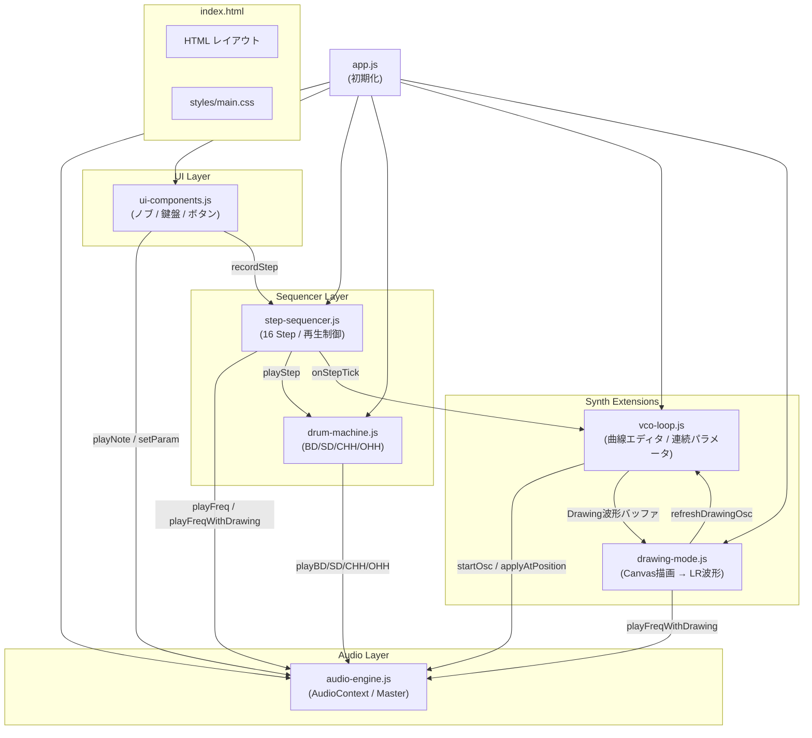
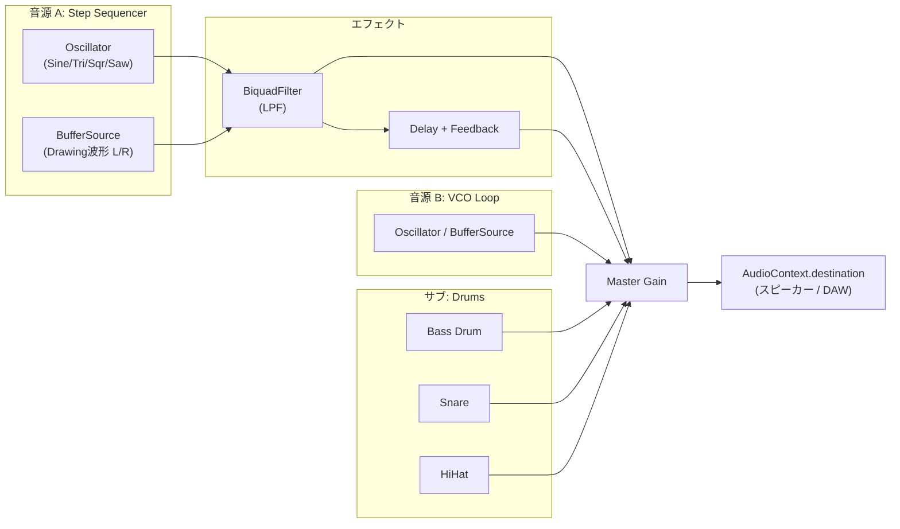

# DLOSy20 - ソフトウェア技術ドキュメント

## 技術スタック

| レイヤー     | 技術              | 備考                                                    |
| ------------ | ----------------- | ------------------------------------------------------- |
| マークアップ | HTML5             | セマンティック構造、単一ページ                          |
| スタイリング | Vanilla CSS       | CSS変数でデザインシステム管理                           |
| ロジック     | JavaScript (ES6+) | クラスベース、フレームワーク不使用                      |
| 音声処理     | Web Audio API     | OscillatorNode / BufferSource / BiquadFilter / GainNode |
| フォント     | Google Fonts      | Orbitron (Display) / Share Tech Mono (Mono)             |
| 開発サーバー | npx serve         | Node.jsベースの静的サーバー                             |

> [!NOTE]
> フレームワーク（React/Vue等）やバンドラー（Vite/Webpack等）は使用していません。
> すべてのJSファイルは `<script>` タグで直接読み込まれます。

---

## ソフトウェア構成図

### ファイル構造

```
DLOSy20/
├── index.html                 ← エントリーポイント（レイアウト定義）
├── styles/
│   └── main.css               ← 全スタイル定義（CSS変数 + コンポーネント）
├── js/
│   ├── audio-engine.js        ← Web Audio API 音声エンジン
│   ├── ui-components.js       ← ノブ・鍵盤・ボタン UI
│   ├── step-sequencer.js      ← 16ステップシーケンサー
│   ├── drum-machine.js        ← ドラムマシン (BD/SD/CHH/OHH)
│   ├── vco-loop.js            ← VCO Loop 曲線エディタ
│   ├── drawing-mode.js        ← Drawing Mode 描画→波形変換
│   └── app.js                 ← メイン初期化スクリプト
└── Doc/
    └── architecture.md        ← 本ドキュメント
```

### モジュール依存関係



### 音声ルーティング



---

## 開発サーバー起動手順

### 前提条件

- **Node.js** (v16以上) がインストール済みであること

### コマンド

```powershell
# プロジェクトフォルダで実行
cd c:\Freefile\PROJECT\2026\02_DLOSyV2603\2_prj\DLOSy20
npx -y serve@latest ./
```

起動後、以下のURLにアクセス：

```
http://localhost:3000
```

> [!TIP]
> `npx -y` により `serve` パッケージを自動インストール＆実行します。
> ポートが使用中の場合は `3001` 等の別ポートが自動割り当てされます。

### 停止

ターミナルで `Ctrl + C` を押してサーバーを停止します。

### 代替手段（Python）

```powershell
cd c:\Freefile\PROJECT\2026\02_DLOSyV2603\2_prj\DLOSy20
python -m http.server 3000
```

---

## 主要モジュール概要

| モジュール          | 責務                                            | グローバル変数名 |
| ------------------- | ----------------------------------------------- | ---------------- |
| `audio-engine.js`   | AudioContext管理、シンセ/ドラム発音、エフェクト | `audioEngine`    |
| `ui-components.js`  | ノブ操作、鍵盤UI、PCキーボード入力マッピング    | `uiComponents`   |
| `step-sequencer.js` | 16ステップの記録/再生/テンポ/スイング制御       | `stepSequencer`  |
| `drum-machine.js`   | 4トラック(BD/SD/CHH/OHH)のパターン管理          | `drumMachine`    |
| `vco-loop.js`       | 8パラメータの曲線エディタ、連続オシレーター     | `vcoLoop`        |
| `drawing-mode.js`   | Canvas描画→LR波形変換、4スロット管理            | `drawingMode`    |
| `app.js`            | 全モジュールの初期化、AudioContext起動          | —                |
